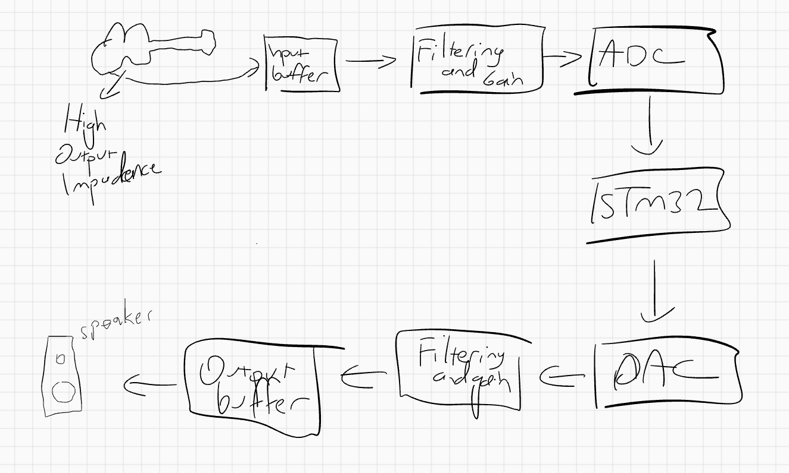

# STM32 ADC DAC Project 

The goal is simple. Make a simple PCB with STM32F103C8Tx + ADC + DAC with Audio Analog front end to process raw Guitar pick up signals and drive a simple speaker. 

Following things I want to learn:

* Learn KiCad
* Learn Embedded C -> Implement simple DSP algo on STM32 on a Audio stream
* Learn modern PCB design techniques on mixed design (analog + Digital) 
* Learn aarch64 architecture

I will follow this video: https://www.youtube.com/watch?v=aVUqaB0IMh4

